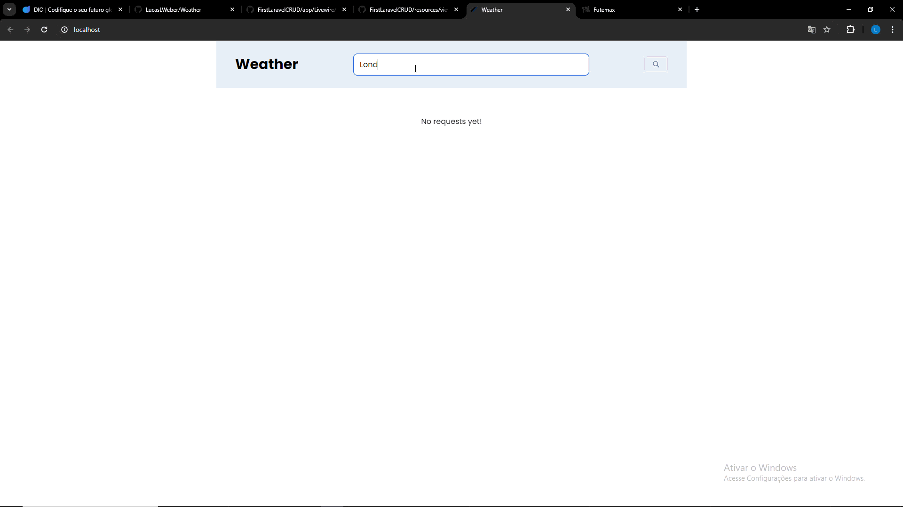

# Weather Project

Projeto consumindo [Weather API](https://www.weatherapi.com/) onde o usuário insere sua cidade e o projeto devolve a previsão do tempo do dia.

## Tecnologias utilizadas

	

## Gif da aplicação

